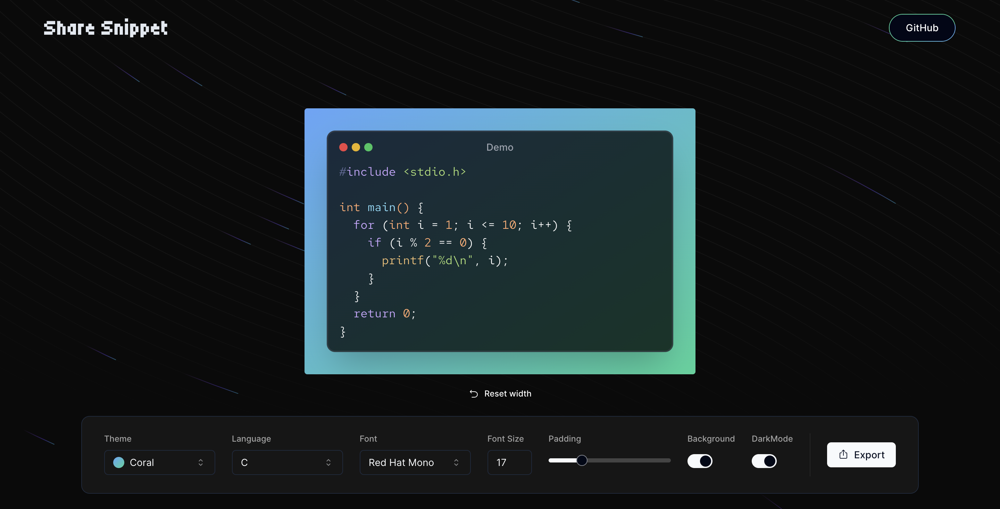

# ShareSnippet

ShareSnippet is a web application designed to simplify the process of creating, customizing, and sharing code snippets. With a variety of themes, syntax highlighting, and customization options, ShareSnippet allows developers to showcase their code in a visually appealing and organized manner.

Check out the live application here: [ShareSnippet](https://sharesnippet.vercel.app/)

## Table of Contents

- [Installation](#installation)
- [Usage](#usage)
- [Screenshots](#screenshots)
- [License](#license)

## Installation

### Prerequisites

Make sure you have Node.js and npm installed on your machine.

- [Node.js](https://nodejs.org/)
- [npm](https://www.npmjs.com/)

### Steps

1. Clone the repository:

   ```bash
   git clone https://github.com/yourusername/ShareSnippet.git
   cd ShareSnippet
   ```

2. Install the dependencies:

   ```bash
   npm install
   ```

3. Run the development server:

   ```bash
   npm run dev
   ```

4. Open [http://localhost:3000](http://localhost:3000) with your browser to see the result.

## Usage

1. **Select Theme**: Choose from a variety of themes to match your style.
2. **Choose Language**: Select the programming language for syntax highlighting.
3. **Customize Fonts and Sizes**: Adjust the font type and size to your preference.
4. **Modify Padding**: Adjust the padding for better visual presentation.
5. **Toggle Background and Dark Mode**: Switch between background options and dark mode for optimal viewing.
6. **Export**: Export your beautifully formatted code snippets with a single click.

## Screenshots

### Editor Window



## License

This project is licensed under the MIT License - see the [LICENSE](LICENSE) file for details.
